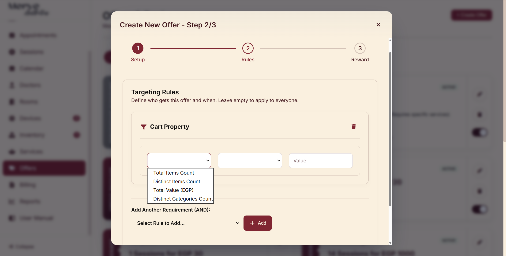

# Testing

[Test Cases](Test%20Cases%203153e63cbeb381ebb60ecbac3ea70923.csv)

## User Experience Notes:

- [ ]  when opening any dialog disable the background, as it keeps closing the dialog by mistake (especially when selecting text).
- [x]  reject adding an item to the inventory with old or today’s date in expiration date.
- [x]  don’t offer time slots that is already booked when adding an appointment.
- [ ]  when booking more than one session it verifies the time availability at the end, if you offered just the available it will be solved.
- [ ]  make option to pay part of the bell and keep it in pending.
- [ ]  after clicking no show icon add option to cancel it as it can be click by mistake (there is only options book another appointment or not).
- [ ]  set restrictions on time slots of the doctors or make the calendar and appointments view the 24 hours, as the user can add appointment in late time hour and doesn’t appear in the calendar (solves 10).
- [ ]  in the billing make not “using any offer” a choice.
- [ ]  if a patient completes a session for a service during an offer’s time interval, then he should take the offer even if he paid after the expiration time, and if a patient completes a session before an offer added he shouldn’t take the offer (if that’s right according to the business).
- [ ]  when completing an appointment from Appointment’s calendar navigate to “End session” window, that will prevent many conflicts from happening.
- [ ]  offer the type of service when making a package based on the available payment method in that service.
- [ ]  remove date constraint from rules section.
- [ ]  I see that cart property option isn’t useful in our case as there is no cart, each service being paid separately or in package.

